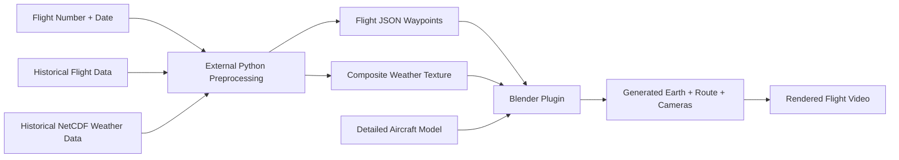

# Historical Flight and Weather Visualization in Blender

Course: **Developing Blender Plugins for Digital Art and Content Creation**

## Week 1

### Project Idea

For my final course project, I want to create a Blender plugin that visualizes a real historical commercial flight using real-world flight and weather data.

The project is not intended to be a professional aviation simulator. Instead, the goal is to create a visually understandable and cinematic Blender scene that helps viewers imagine the experience of a flight through route movement, weather, atmosphere, camera motion, and world context.

The plugin will combine:

- A full Earth/world model inspired by my previous shader and geometry-nodes assignment.
- Historical flight waypoint data, including latitude, longitude, altitude, speed, heading, and timestamps.
- Historical weather data from NetCDF or reanalysis datasets.
- A detailed aircraft model animated along the real flight path.
- A third-person chase camera following behind the aircraft.
- Additional camera views for cinematic presentation.
- Weather visualization through generated textures, atmosphere effects, clouds, lighting, or other Blender visual techniques.
- A final rendered video as the main presentation artifact.

### High-Level Workflow

The project will use an external Python preprocessing script because scientific weather formats such as NetCDF are easier to process outside Blender. The Blender add-on will then import clean JSON and image assets and focus on visualization, animation, UI, and rendering.

### Planned Plugin Features

- Blender sidebar panel for the flight visualization tool.
- Button to load processed flight and weather data.
- Button to generate or reset the visualization scene.
- Import or link a detailed aircraft model.
- Create a full Earth model with atmosphere and route context.
- Convert flight waypoints into a 3D path.
- Animate the aircraft along the historical route.
- Rotate the aircraft according to heading or path direction.
- Add route curves, origin/destination markers, and flight labels.
- Add multiple camera views.
- Use a third-person chase camera as the default view.
- Apply weather information through a composite map texture, atmosphere layer, cloud layer, or sky effect depending on feasibility testing.
- Set up a renderable animation for the final video.

### Data Sources and References

#### Flight Data

- [OpenSky Network REST API](https://openskynetwork.github.io/opensky-api/rest.html)  
  Provides aircraft state vectors, current flight data, and experimental track endpoints.

- [OpenSky Historical Data with Trino](https://openskynetwork.github.io/opensky-api/trino.html)  
  Main candidate for historical flight waypoint extraction. This can provide actual aircraft positions, altitude, speed, heading, and timestamps.

- [OurAirports Open Data](https://ourairports.com/data/)  
  Public-domain airport dataset useful for airport coordinates, airport names, and origin/destination markers.

#### Weather and NetCDF Data

- [Copernicus ERA5 Reanalysis Data](https://cds.climate.copernicus.eu/datasets/reanalysis-era5-single-levels)  
  Candidate source for historical weather data. ERA5 provides global hourly reanalysis data from 1940 to present.

- [Xarray NetCDF Documentation](https://docs.xarray.dev/en/stable/user-guide/io.html)  
  Useful for reading NetCDF files and converting weather variables into Blender-friendly textures or JSON.

- [Open-Meteo API](https://open-meteo.com/en/docs)  
  Possible backup or comparison source for visible weather variables such as cloud cover, precipitation, fog, and weather codes.

- [NOAA Aviation Weather Center Data API](https://aviationweather.gov/data/api/)  
  Useful reference for aviation weather products such as METAR, TAF, SIGMET, and station data.

### Related Blender Plugins

- [BlenderGIS](https://github.com/domlysz/BlenderGIS)  
  A Blender add-on for importing GIS data such as shapefiles, raster images, GeoTIFF DEM files, OpenStreetMap data, web maps, and terrain. This is related to the geographic and Earth/world visualization part of my project.

- [Blosm / Blender-OSM](https://github.com/vvoovv/blosm)  
  A Blender add-on for importing OpenStreetMap data, terrain, satellite imagery, roads, buildings, and GPX tracks. This is useful as a reference for bringing real-world location data into Blender.

- [BlenderNC](https://github.com/blendernc/blendernc)  
  A Blender add-on for visualizing scientific gridded datasets such as NetCDF, GRIB, and Zarr files. This is closely related to the weather-data part of my project, especially the idea of converting NetCDF weather data into visual textures.

- [Tacview Flight Path Importer for Blender](https://github.com/pehaka4-dot/Tacview-Flight-Path-Importer-for-Blender)  
  A Blender add-on that imports Tacview CSV flight data and reconstructs aircraft flight paths as 3D animations. This is related to the aircraft waypoint animation part of my project, although my project will focus on historical commercial flight data instead of Tacview exports.

- [GPX-Importer](https://github.com/zuggamasta/GPX-Importer)  
  A Blender add-on for importing GPS Exchange Format files. This is a useful reference for converting geographic route data into Blender geometry.

- [Motion Path Pro](https://extensions.blender.org/add-ons/real-time-paths/)  
  A Blender extension for visualizing object motion paths in real time. This is related to polishing and debugging the aircraft and camera animation paths.

- [Maps Models Importer](https://github.com/eliemichel/MapsModelsImporter)  
  A Blender add-on for importing captured Google Maps or Google Earth 3D models. This is related to real-world scene context, although my project does not plan to depend on captured Google data.

### Visual Direction

The final scene should feel like a cinematic flight visualization rather than a technical map only.

Planned visual elements:

- Full Earth model for world context.
- Atmosphere glow around the planet.
- Route line showing the historical flight path.
- Aircraft moving through the scene along actual waypoint data.
- Sky, clouds, and distant horizon for the main camera view.
- Composite weather texture generated from historical weather variables.
- Camera views including chase camera, route overview, and cinematic shots.
- Optional labels for altitude, speed, timestamp, origin, and destination.

Possible weather variables to combine into the visual texture:

- Cloud cover.
- Rain or snow precipitation.
- Fog, haze, or low-cloud visibility effects.
- Storm or lightning indicators if available.

The exact weather rendering method will be confirmed during the feasibility phase. Possible options include applying the weather texture to an Earth/cloud layer, using it as a visible map overlay, or translating the texture into local sky and atmosphere effects.

### Scope

#### In Scope

- Historical flight visualization from processed data.
- External preprocessing script for flight and weather data.
- Blender plugin for scene generation and animation.
- Actual waypoint-based aircraft movement.
- Full Earth model.
- Detailed aircraft model provided separately.
- Composite weather visualization.
- Multiple camera views.
- Rendered final video.

#### Out of Scope for the First Version

- Real-time live flight tracking.
- Airport-level or runway-level simulation.
- Air traffic control behavior.
- Full cockpit instruments.
- Physically accurate weather simulation.
- Direct NetCDF parsing inside Blender.
- Seat recommendation logic.

Seat selection could be future work, for example by comparing route direction, sun position, cloud cover, and left/right window views.

### Development Plan

Instead of weekly milestones, I will divide the project into three main parts.

#### Part 1: Research and Feasibility

- Confirm OpenSky historical data access and query workflow.
- Choose a suitable historical commercial flight for the final demo.
- Test querying by flight number and date.
- Extract waypoint data with latitude, longitude, altitude, speed, heading, and timestamp.
- Evaluate ERA5 as the main candidate for historical NetCDF weather data.
- Test conversion of weather variables into a composite image texture.
- Test where the weather texture is most effective in Blender.
- Confirm that the provided detailed aircraft model can be imported and animated.

#### Part 2: Core Functionality

- Build the Blender plugin UI.
- Load processed flight JSON and weather image data.
- Generate Earth, atmosphere, route curves, markers, and labels.
- Animate the aircraft along the historical waypoint path.
- Add aircraft orientation based on direction or heading.
- Add chase camera and additional camera views.
- Add basic weather visualization into the scene.
- Prepare the scene for rendering.

#### Part 3: Polish and Finalization

- Improve lighting, atmosphere, clouds, and camera movement.
- Smooth aircraft motion and rotation.
- Improve route and label readability.
- Add fallback sample data so the demo remains reliable.
- Render the final video.
- Document the data pipeline, plugin features, and design decisions.

### Expected Final Result

The final result will be a rendered Blender video generated from a custom plugin workflow. The video will show a detailed aircraft flying along a historical commercial route, with Earth, atmosphere, route context, weather visualization, and cinematic camera movement.

The project will demonstrate how Blender can be used not only for manual digital art creation, but also for data-driven visual storytelling.
