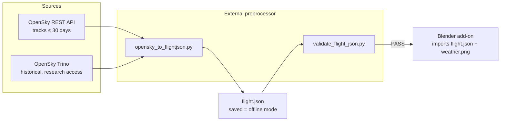

# Flight preprocessing pipeline

This directory holds the **external preprocessor** for the Blender flight
visualization project. It turns flight-tracking data from the
[OpenSky Network](https://opensky-network.org/) into a single, self-contained
`flight.json` file that the Blender add-on imports and animates.

**Offline mode:** a `flight.json` produced once from a real OpenSky request is
fully self-contained — commit/keep it and re-import it any time without touching
the API. (There is intentionally **no synthetic sample data**; offline = a saved
real flight.)

## Purpose: why preprocess outside Blender?

Blender's bundled Python is awkward for network I/O, OAuth2, and heavy data
wrangling: shipping `requests`/`numpy` into Blender, doing token refresh, and
parsing API responses inside the viewport would make the add-on fragile and
slow to iterate on. So we split the work:

- **Outside Blender (this directory):** fetch, clean, resample, derive missing
  fields (speed/heading), compute stats, and emit a strict, validated
  `flight.json`. Weather imagery is similarly baked to a `weather.png` later.
- **Inside Blender (the add-on):** *only* consume `flight.json` (and later
  `weather.png`). No network, no API keys, no surprises. The add-on just reads
  a well-defined file and builds the scene.

The boundary between the two is the data contract in
[`FLIGHT_SCHEMA.md`](./FLIGHT_SCHEMA.md). As long as a producer emits a file
that passes the validator, the Blender side is happy.

## Architecture



## Getting OpenSky OAuth2 credentials

OpenSky moved to **OAuth2 client-credentials**. To get a client:

1. Create a free account at <https://opensky-network.org/>.
2. Go to **Account → API Client** and **create a new API client**.
3. You'll be given a **`clientId`** and **`clientSecret`** (the secret is shown
   once -- save it).
4. Put them in a `credentials.json` next to the client, e.g.:

   ```json
   {
     "clientId": "your-client-id",
     "clientSecret": "your-client-secret"
   }
   ```

Anonymous access also works **with reduced rate limits** (and no historical
Trino access), which is fine for occasional REST track lookups. Authenticated
clients get higher limits.

## Install

The runtime dependencies are small:

```bash
pip install requests numpy
```

This repo also vendors the official OpenSky Python client under
`opensky-api/python/`. The fetch script adds it to `sys.path` automatically, or
you can install it editable so it's importable from anywhere:

```bash
pip install -e opensky-api/python
```

`validate_flight_json.py` is **stdlib-only** and needs no dependencies.

> **No hardcoded airport coordinates.** Origin/destination positions are derived
> dynamically from the track's first/last waypoints (the actual departure/arrival
> points); the ICAO code comes from the API. Nothing about airport locations is
> stored locally.

## Usage

### `opensky_to_flightjson.py` — fetch a real flight

The OpenSky tracks API is keyed on the transponder `icao24`, **not** on a flight
number. You can either let the tool resolve a callsign for you, or pass an
`icao24` directly.

```bash
# By callsign + departure airport (the tool resolves callsign -> icao24):
python3 opensky_to_flightjson.py \
    --callsign DLH401 --dep-icao KJFK \
    --date 2024-03-21 \
    --out flight.json

# By transponder hex (skips the resolve step):
python3 opensky_to_flightjson.py \
    --icao24 3c6589 \
    --out flight.json
```

> ⚠️ **REST tracks are experimental and only cover roughly the last 30 days.**
> For older flights you need the Trino historical interface (below).

Once written, that `flight.json` **is** the offline dataset — re-import it in
Blender any time with no network/credentials.

### `validate_flight_json.py` — check any flight.json

Run this on every produced file before handing it to Blender:

```bash
python3 validate_flight_json.py flight.json
```

It prints `PASS` (exit 0) or `FAIL` with a bullet list of every problem
(exit 1). It can also be imported:

```python
from validate_flight_json import validate
errors = validate(json.load(open("flight.json")))
assert errors == []
```

## OpenSky facts & limits worth knowing

- **Auth:** OAuth2 **client-credentials** only (clientId/clientSecret →
  bearer token). The older username/password Basic auth is gone. Anonymous use
  works with **reduced rate limits**.
- **REST tracks are short-lived & experimental:** the `/tracks` endpoint only
  returns data for roughly the **last 30 days**, and the track waypoints carry
  **no speed** field — `speed_mps` must be derived from consecutive points
  (`haversine(prev, cur) / Δt`), per the schema rules.
- **Keyed on `icao24`, not flight number:** the API does not know "LH401". You
  must resolve a **callsign → icao24** first (e.g. via the states/flights
  endpoints), then fetch the track for that `icao24`.
- **IATA vs ICAO callsigns:** flight numbers are usually IATA (`LH401`), but the
  callsign broadcast on the wire is ICAO (`DLH401`). Map the airline's IATA
  prefix to its ICAO designator (`LH` → `DLH`, `BA` → `BAW`, `AF` → `AFR`, …)
  before searching. Store the IATA number in `meta.flight_number` and the ICAO
  callsign in `meta.callsign`.
- **Trino historical:** the historical database (queried via Trino) needs
  **approved research access**. Always **filter on the partition column**
  (`hour` for `state_vectors_data4`, `day` for `flights_data4`) — these tables
  are partitioned, and an unpartitioned query will scan everything and be
  rejected or extremely slow. Trino's `velocity` column gives real ground speed,
  so derived speed is only needed for REST tracks.

## `flight.json` schema

The full, authoritative contract is in
[`FLIGHT_SCHEMA.md`](./FLIGHT_SCHEMA.md). Summary (schema **v1**):

| Field | Type | Meaning / units |
|-------|------|-----------------|
| `schema_version` | int | always `1` |
| `meta.flight_number` | str\|null | IATA flight number, e.g. `LH401` |
| `meta.callsign` | str\|null | ICAO callsign as broadcast, e.g. `DLH401` |
| `meta.icao24` | str\|null | transponder hex, lowercase |
| `meta.date` | str | UTC departure date, ISO `YYYY-MM-DD` |
| `meta.source` | str | `opensky-rest-tracks` \| `opensky-trino` |
| `meta.generated_at` | str | ISO 8601 UTC timestamp of generation |
| `origin` / `destination` | obj\|null | `{icao, iata, name, lat, lon}`; null if unknown |
| `waypoints[]` | list (≥2) | chronological track samples |
| `waypoints[].t` | int | absolute **Unix seconds** |
| `waypoints[].t_rel` | float | seconds since first waypoint (`t_rel[0] == 0.0`) |
| `waypoints[].lat` / `lon` | float | WGS-84 decimal degrees |
| `waypoints[].alt_m` | float | altitude in **meters** (geo, fallback baro; 0 on ground) |
| `waypoints[].heading_deg` | float | true track, degrees clockwise from north, `[0,360)` |
| `waypoints[].speed_mps` | float | ground speed in **meters/second**, `≥ 0` |
| `waypoints[].on_ground` | bool | on-ground flag |
| `stats.num_waypoints` | int | `== len(waypoints)` |
| `stats.duration_s` | int | `t[-1] - t[0]` |
| `stats.distance_km` | float | summed great-circle distance along the path |
| `stats.max_alt_m` | float | max altitude over the track |
| `stats.max_speed_mps` | float | max ground speed over the track |

### Units

**SI everywhere**: distances in **meters** (`alt_m`), speeds in
**meters/second** (`speed_mps`), times in **Unix seconds** (`t`). No knots, no
feet. OpenSky already returns meters and m/s, so no unit conversion is needed
from the API — just keep it SI all the way to Blender.
