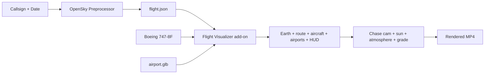

# Historical Flight Visualization in Blender

Turn a **real airline flight** into an animated fly-along on a textured 3D Earth

External OpenSky preprocessor → `flight.json` → one-click Blender add-on

DBP Course · Final Presentation

<!--
Final presentation. Fill in your name/date. The project: a real historical commercial flight, visualized end to end.
-->

---

# The Idea

Take a **real airline flight** and replay it as a smooth fly-along on a 3D Earth.

**Two parts**
- **Outside Blender** — a Python tool downloads the flight from the **OpenSky Network**, cleans it, and writes a small **`flight.json`**
- **Inside Blender** — a **one-click add-on** reads that file and builds the whole scene

**Why two parts?**
- Network and login code stay out of Blender
- The two parts meet at one simple file: **`flight.json`**
- Once downloaded, a flight works **offline**, every time

<!--
Recap the concept: a preprocessor and an add-on, meeting at flight.json.
-->

---
layout: image
image: /hero_cruise.png
class: text-white
---

# Final Prototype

Chase camera over night-lit Europe — live HUD, route trail, atmosphere glow.

<!--
The money shot. DLH67K Frankfurt to Madrid at cruise. Point out: HUD (callsign/alt/speed/UTC/elapsed), the glowing route, the blue atmosphere limb, color grade + bloom.
-->

---

# What's in the Scene

  

Airport at departure

  

Banks into turns

  

Descent into arrival

Detailed Earth (day / night / mountains) · airports at both ends · the sun placed
by the flight's **real time of day** · the plane pitches and banks · on-screen
readout · night light · atmosphere and color polish · **one-click video export**

<!--
Feature montage. Everything is a toggle in the sidebar. The sun is placed by the real time of day, not a spinning Earth.
-->

---

# Architecture

Everything connects through one file: **`flight.json`**. A small checker makes
sure the file is valid before Blender uses it. You can also **fetch a flight
straight from the add-on** — it runs the Python tool for you.

<!--
Same diagram as the README. Everything meets at flight.json, which is validated before use. Fetch can run from the UI.
-->

---

# Challenge: getting the data from OpenSky

**The tricky parts**
- You can't search by flight number like "LH401" — the data is keyed to the **aircraft's radio ID** (`icao24`)
- So I look up the aircraft first, then get its track
- Login uses a **token** (OAuth2)
- Only the **last ~30 days** of flights are available

**How I handled it**
- Enter a **callsign + departure airport**, or the aircraft ID directly
- If the date is too old, stop early with a **clear message**
- Speed isn't in the data, so I **compute it** from the points
- The download code stays **outside Blender**; the add-on finds the right Python automatically

<!--
Second deep-dive: data access. Can't search by flight number - keyed to aircraft radio ID. Token login, 30-day window. Practical guards in plain terms.
-->

---

# Cleaning & smoothing the flight data

The raw data is rough: points arrive unevenly, jitter around, and have long gaps.
It goes through a small **pipeline** before the plane ever moves:

1. **Place on the globe** — turn each lat/lon/altitude into a 3D point, measured from the **ground right below** it
2. **De-jitter** — average each point with its neighbours to smooth the GPS wobble, but **keep its height** (so it can't sag into the Earth)
3. **Follow the curve** — between points, move along the **curve of the Earth**, not a straight line through it

4. **Even out the timing** — re-sample the path at **regular intervals**, so dense spots and long gaps are treated the same
5. **Equal distance per frame** — finally, space the points so the plane moves the **same distance each frame** → steady speed

Techniques: radius-preserving moving average · spherical (great-circle) interpolation · uniform-time resampling · constant arc-length re-parametrization

**Result** — no more surging, stalling, or flying underground. The biggest per-frame jump dropped from **~17× the normal step to about 1×** (even speed).

<!--
Walk the 5-step pipeline in plain terms. The small techniques line names the actual methods: radius-preserving moving average (de-jitter), spherical/great-circle interpolation (follow the curve), uniform-time resampling (even timing), constant arc-length (equal distance per frame). The 17x->1x is the payoff.
-->

---

# Realistic plane rotation

The data only gives **position**, not which way the plane faces. I build the
orientation from the path itself, so it flies naturally.

**Heading**
Nose points toward the **next point** on the path — so it always faces where it's going.

**Pitch**
That direction includes going up or down, so the nose **tilts up on climb** and **down on descent** for free.

**Bank**
When the path curves, the plane **leans into the turn** — the sharper the turn, the more it rolls (capped at 30°, like a real airliner).

"Up" always points **away from the Earth's center**, so the plane sits level on
the globe instead of drifting as it crosses the world.

<!--
Orientation is derived from the path, not the data. Nose to next point (heading + pitch in one), bank from how sharply the path turns (clamped 30 deg), up = Earth radial so it stays level on the sphere.
-->

---

# Roadmap

## Done ✅
- Download flights from OpenSky, save as `flight.json`
- One-click add-on (+ **fetch from the UI**)
- Smooth, steady motion that stays above the ground
- Chase camera (level, never underground)
- Plane pitches and banks in turns
- Airports at both ends
- On-screen readout (callsign, altitude, speed, time)
- Night light · atmosphere · nicer colors
- Save to video · tests · easy install · docs

## Future work 🔭
- **Weather layer** (clouds, wind) — left out for now
- **Older flights (30+ days)** — needs special OpenSky access
- More camera angles and motion blur
- Sharper Earth textures for close-ups

<!--
Most of the plan is done. Weather was left out on purpose to keep a solid flight visualization. Older-than-30-days needs external OpenSky access.
-->

---
layout: center
class: text-center
---

# Thank you

A real airline flight → a smooth, cinematic fly-along on a 3D Earth,
built by a **one-click Blender add-on**.

**Try it**
- `./blender/build_addon.sh` → install the zip
- Open `flight_visualization.blend`
- **N ▸ Flight** → Fetch or Load & Build → **Render Video**

**Repo**
- Add-on: `blender/flight_viz_addon/`
- Preprocessor + tests: `preprocess/`
- Design notes: `DESIGN.md`

**github.com/erinc-emre/DBP**

Questions?

<!--
Wrap up. Repo: github.com/erinc-emre/DBP. Offer a live demo (Fetch & Build), or play the rendered MP4.
-->
