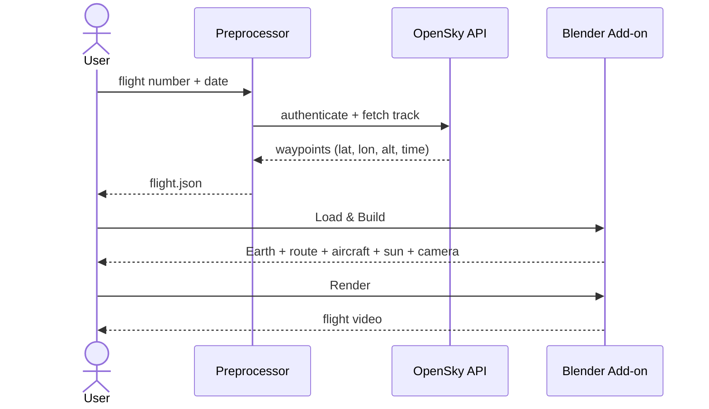

# Historical Flight Visualization in Blender

Mid-project check-in

Erinc Celikten · Practical Course: Developing Blender Plugins

---

# Idea Recap

- A **real historical commercial flight**, visualized in Blender from real data
- OpenSky flight data → aircraft animated on a textured Earth
- **Cinematic and data-driven, not a simulator**
- Deliverable: a rendered video

---

# Current State of the Prototype

  
  
  

- One-click add-on: OpenSky → `flight.json` → full scene
- Demo flight: **Lufthansa DLH67K, Frankfurt → Madrid** (425 waypoints)
- Earth: **16K day / 13.5K night** + real elevation, clouds, normal/specular
- Great-circle route · animated 747 · chase camera · UI scale & speed controls
- Sun synced to the flight's real UTC time (a night departure)

---

# Pipeline

Heavy data stays outside Blender; the add-on only consumes a clean file.

---

# Remaining to Implement

- **Aircraft motion** — path is smoothed, but turns still snap; add eased
  interpolation + gentle banking
- **Weather layer** — ERA5 reanalysis → composite texture, mapped onto a
  cloud/atmosphere shell
- Final render settings + the deliverable video
- Polish: lighting, camera movement, optional HUD labels

---

# Updated Roadmap

## Done ✅
- Data pipeline
- Add-on + UI (scale & speed)
- 16K / 13.5K Earth + elevation + clouds
- Aircraft + route + chase cam
- Sun-time sync

## Until final 🔭
- Smooth aircraft motion (banking)
- Weather MVP + in-scene
- Final render
- Docs

---

# MVP vs Stretch

## MVP
- Bundled real flight
- Earth + route + aircraft
- Chase camera
- One weather layer
- Rendered video

## Stretch
- Multi-variable weather
- HUD labels
- Multiple cameras
- Day/night terminator
- Seat-side recommendation

---

# Uncertainties / Open Decisions

- **Vertical exaggeration for the final render** — true-to-scale (plane invisible
  from orbit) vs exaggerated for visibility. Now a configurable knob
  (currently plane ×100, altitude ×10). How much for the deliverable?
- **Weather source** — ERA5 (rich, heavy) vs Open-Meteo (simple JSON) — leaning ERA5
- **Weather look** — 2D texture on a cloud shell vs volumetric vs sky shader —
  leaning texture shell

---
layout: center
class: text-center
---

# Thank you

Questions &amp; feedback welcome

