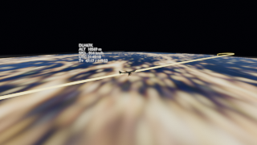
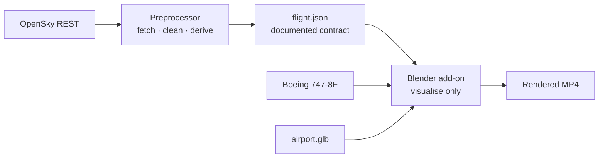

# Historical Flight Visualization in Blender

A one-click Blender add-on that turns a **real historical flight** into a
cinematic fly-along on a textured 3D Earth

Course: <em>Developing Blender Plugins for Digital Art and Content Creation</em> 
&lt;Your Name&gt; · Final Presentation

<!--
Speaker note: from a flight number + date to a rendered video, entirely inside Blender.
-->

---
layout: image-right
image: ./assets/hero.png
---

# Idea recap

**Take one real commercial flight → tell its visual story.**

- External Python **preprocessor** pulls the real track from **OpenSky** and
  writes a clean `flight.json`.
- A Blender **add-on** consumes that JSON and builds the whole scene in one click:
  Earth, route, animated aircraft, sun, chase camera — then renders an MP4.
- **Offline by design:** once fetched, a flight replays with no network or keys.

 

> Not a simulator — a **data-driven visual story** of one specific flight.

Demo flight: **Lufthansa DLH67K, Frankfurt → Madrid.**

---
layout: image
image: ./assets/final_look.png
backgroundSize: contain
---

# Final prototype

Chase cam over the night side · HUD (callsign / alt / speed / UTC / elapsed) ·
atmosphere limb · color grade + bloom

---

# Final prototype — what shipped

**Scene & data**
- Real OpenSky track → validated `flight.json`
- Procedural Earth (16K day / night / normal / spec), real terrain, clouds
- Sun synced to the flight's **real UTC** time
- **Airport model** placed at both ends

**Camera & motion**
- Chase cam: looks at the plane, **level horizon**, terrain-aware (never underground)
- **Constant-speed** glide; **banks into turns**
- On-screen **HUD**

**Look & UX**
- Night **fill light**, **atmosphere glow**, AgX **grade + bloom**
- Sidebar panel: fetch, scale, animation, calibration, render
- **Fetch & Build** from the UI; **Render Video** button

---

# Architecture — two clean halves

- **Outside Blender:** all network / OAuth2 / data wrangling (`requests`, OpenSky client).
- **Inside Blender:** only consumes `flight.json` — no network, no credentials.
- They meet at a **documented JSON schema** enforced by a stdlib validator, so the
  two halves evolve independently.

---

# Challenge 1 — smooth, faithful motion from messy data

**The problem.** Real ADS-B tracks are sampled *very* unevenly — one fetched
flight had **34 gaps up to ~7 min**, and even **frozen-then-jumping** positions.
Naive time-based playback **surged and stalled**, and a big gap's straight-line
interpolation cut a **chord ~160 km through the Earth**.

**The fix**
- Resample to a uniform time grid, then to **constant arc-length** → steady glide
- Interpolate **along the sphere** (normalized lerp), not a chord
- Smoothing **preserves each point's radius** (no sag inside the Earth)
- Altitude referenced to the **local terrain** beneath each point

**Result (per-frame step)**

| metric | before | after |
|---|--:|--:|
| peak / mean | 17.6× | **1.0×** |
| frame jerk | 63% | **21%→0** |
| below surface | yes | **never** |

---

# Challenge 2 — getting the data & automating it

**OpenSky has no "flight number" key.** The API is keyed on the aircraft
transponder **`icao24`**, not "LH67K".

- Resolve **callsign → `icao24`** via the departures endpoint, then fetch the track.
- Auth moved to **OAuth2**; REST tracks only cover the **last ~30 days** (guarded early).

**Automated from the UI.** A **Fetch from OpenSky** panel runs the preprocessor as a
**subprocess** — keeping `requests` / OAuth2 *out* of Blender — then builds the scene.

- Gotcha solved: Blender's GUI has a minimal `PATH`, so the default `python3` lacked
  `requests` → the add-on now **auto-discovers** a Python that has it.

 

> Enter a callsign + date → **Fetch & Build** → a rendered flight, no command line.

---

# Roadmap — implemented vs. future work

## ✅ Implemented
- OpenSky preprocessor + JSON schema + validator + tests
- Add-on: panel, operators, packaging, **in-UI fetch**
- Procedural Earth, real terrain, clouds, time-synced sun
- Constant-speed motion, **banking**, path always above terrain
- Chase camera (level, terrain-aware, zoom)
- **HUD**, airports at both ends
- Night fill light, **atmosphere glow**, **color grade + bloom**
- Render-to-MP4 button

## 🔭 Future work
- **Weather layer** (ERA5 → composite texture / cloud shell) — descoped
- **Historic flights > 30 days** — OpenSky **Trino** research access
- Richer cinematics (multi-camera, orbit reveals)
- Auto-fill HUD/airport metadata from flight meta
- Source-true speed (REST tracks lack velocity)

---
layout: center
class: text-center
---

# Thank you

A real flight → a cinematic render, one click inside Blender.

Demo video: <code>renders/flight_chase_*.mp4</code> · Code & docs: <code>README.md</code>, <code>DESIGN.md</code>

Questions &amp; discussion

